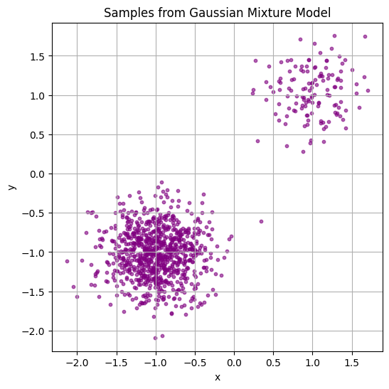
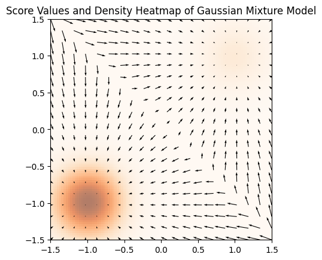
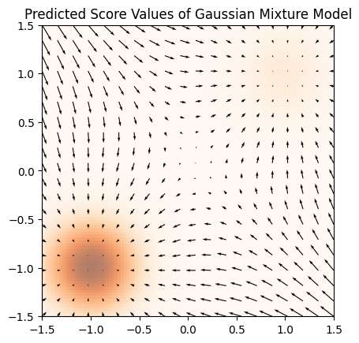
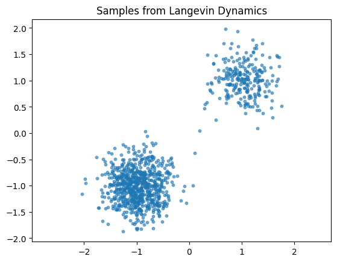
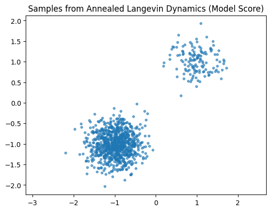
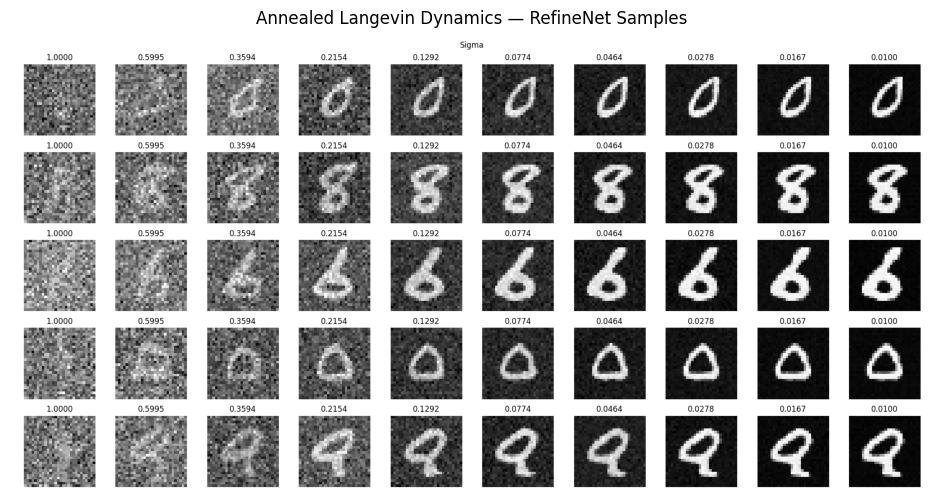

# Score Matching and Langevin Dynamics — Homework 1  
**Course:** Diffusion Models  
**Author:** Alon Gilad  

---

## Introduction

This work examines the principles of **score-based generative modeling**, a framework foundational to modern **diffusion models**. Instead of explicitly modeling a probability density \( p(x) \), we approximate its **score function**, the gradient of its log-density:

\[
\nabla_x \log p(x)
\]

The score indicates the direction of increasing probability in data space. Sampling can then be performed using **Langevin Dynamics**, which combines gradient ascent along the score field with controlled noise injection.

The assignment is structured in two phases:

1. **Score matching and sampling in a 2D Gaussian Mixture Model (GMM)**  
2. **Image generation on MNIST using annealed Langevin dynamics**

This progression introduces the concepts in a simple, interpretable setting before scaling to high-dimensional data.

---

## Gaussian Mixture Model (GMM) Score Matching

### True Data Distribution

**Figure 1.** Samples drawn from a two-component Gaussian Mixture Model. Each cluster corresponds to a distinct mode in the underlying distribution.

### True Score Field

**Figure 2.** Analytic score field for the GMM. Arrows point toward high-density regions, showing how samples are expected to move under Langevin dynamics.

### Learned Score Field (Neural Score Model)

**Figure 3.** Score field predicted by a neural network trained via score matching. The structure of the learned field closely resembles the true score field.

### Sampling with the True Score

**Figure 4.** Samples generated using Langevin dynamics with the **true** score. The process converges to the two cluster modes, reconstructing the original GMM.

### Sampling with the Learned Score

**Figure 5.** Samples generated using the **learned** score. The sample distribution is similar to Figure 4, indicating successful generalization of the score model.

---

## MNIST: Annealed Langevin Dynamics for Image Generation

In high-dimensional settings, sampling is performed across a decreasing sequence of noise levels \( \sigma \), allowing coarse shapes to emerge before fine details.

### Final Generated Samples (RefineNet Score Model)

**Figure 6.** MNIST digit samples generated using annealed Langevin dynamics guided by a learned RefineNet score model. The sampling process transforms noise into coherent digit structure through progressive refinement.

---

## Algorithmic Summary: Langevin Dynamics

\[
x_{t+1} = x_t + \eta \nabla_x \log p(x_t) + \sqrt{2\eta} \, \epsilon_t,
\quad \epsilon_t \sim \mathcal{N}(0, I)
\]

- **Gradient step:** Moves samples toward high-density regions  
- **Noise term:** Prevents collapse to mode centers and encourages exploration  
- **Learned score:** Allows sampling without directly modeling \( p(x) \)

---

## How to Run

```bash
pip install torch numpy matplotlib
jupyter notebook
